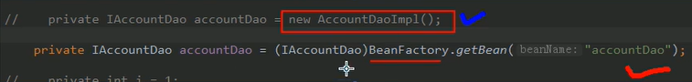
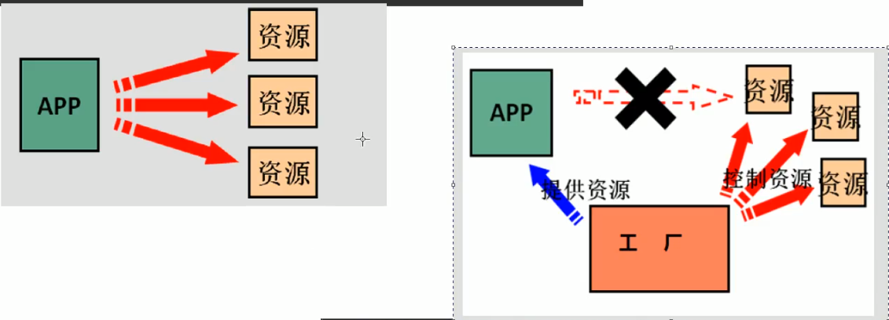

# Spring第一天

对应代码地址：D:\code\JavaCode\spring

# 一. 耦合与解耦

- 工厂模式1，将控制权交给BeanFactory,利用配置文件，防止了service中调用dao的new一个对象，防止了前端（client）中调用service的new构造方法()一次降低耦合

- 工厂模式2，引入容器的概念，利用static代码块，在BeanFactory第一次实例化的时候将所需要的Bean一次装载进Factory中的Map容器中，这样就可以是单例模式，提高效率。
- 详见示例代码

# 二. 理解IOC如何解决耦合

## 2.1 IOC基本概念

将选择创建那个对象的权力交给框架（图中用简单的工厂代替了框架）






## 2.2 Spring中的IOC


### 1.加载核心容器对象

- ApplicationContext与BeanFactory 立即加载还是延迟加载


ApplicationContext：单例对象时适用

BeanFactory：多例模式适用

Spring可以根据配置文件来决定使用哪个~！

- ApplicationContext接口有三个常用的实现类

  ```
  *      ClassPathXmlApplicationContext  要求配置文件在类路径下？ 更常用
  *      类路径（classpath）指的是当整个项目build后，会将所有的Java类和配置文件放在build(target)/classes下！！！
  *      FileSystemXmlApplicationContext  加载任意路径的配置文件
  *      AnnotationConfigApplicationContext  用于读取注解创建容器
  ```

### 2.spring对Bean的管理细节

- 创建bean的三种方式

  1. 使用默认构造函数进行创建:在spring的配置文件中首映bean标签，配置id和class属性之后，且没有其他属性和标签采用的就是默认构造函数，前提是该bean有默认构造函数

     ```java
     <bean id="accountService" class="com.itheima.service.impl.AccountServiceImpl"></bean>
     ```

  2. 使用工厂类(.jar包)中的方法创建对象，并存入spring容器
                如果使用别人写好的jar包中的bean，我们没有办法使用其默认构造函数
                假设factory这个类存在与jar包中，
                我们无法通过修改源码的方式来提供默认构造函数,
                那如果希望得到一个其类中某个方法的返回值对象，只能采用这种方法

     ```java
     <bean id="instanceFactory" class="com.itheima.factory.InstanceFactory"></bean>
     <bean id="accountService" factory-bean="instanceFactory" factory-method="getAccountService"></bean>
     ```

  3. 使用工厂类中的静态方法创建对象，并存入spring容器

     ```java
     <bean id="accountService" class="com.itheima.factory.StaticFactory" factory-method="getAccountService"></bean>
     ```

- bean对象的作用范围

  scope属性

  - singleton  【默认值】单例的

  - prototype   多例的

  - request   作用于web应用的请求范围

  - session   作用于web应用的会话范围

  - global-session  作用于集群环境的会话范围

    

- bean对象的生命周期

  单例对象（生命周期如容器相同）

  - 出生：容器对象创建即创建

  - 活着：容器存在即存在
  - 销毁：容器销毁即销毁

  多例对象

  - 出生：使用对象时（getBean()）spring会创建

  - 活着：对象在使用就一直活着

  - 销毁：靠Java的垃圾回收机制

    

## 2.3 Spring依赖注入

IOC作用：降低程序间的耦合（依赖关系）

但依赖关系肯定还是会存在

依赖注入：将依赖关系的管理交给spring来维护

在当前类中需要用到其他类对象时，由spring提供，我们需要在配置文件中说明

可以注入的对象有三类：

- 基本类型和String
- 其他bean类型（配置文件中配置过的bean）
- 复杂类型。集合类型

#### 注入的方式有三种（构造函数，set，注解）：

- **使用构造函数注入**

<!-- 使用构造函数注入:
       使用标签：constructor-arg
        标签出现在bean标签内部
        标签中的属性
        type:用于指定要注入的数据的数据类型
        index:用于指定要注入的数据给构造函数中指定索引位置的参数赋值
        name:用于指定给构造函数中指定名称的参数赋值【常用】
        ==========以上3个用于指定给构造函数中的哪个参数赋值===========
        value:用于提供基本类型和String类型的数据
        ref:其他bean类型的数据

    优势：
        在获取bean对象时，由于不是采用无参构造，就必须注入数据，否则无法注入成功
    弊端：
        改变了对象的实例化方式，就算用不到参数，也必须注入【所以一般情况下不用】
        -->
- **使用set方法注入**

<!-- 使用set方法注入：
    使用标签：property
    标签出现在bean标签内部
    标签中的属性:
    name:用于指定注入时所调用的set方法名称 setName -> name
    ==========以上3个用于指定给构造函数中的哪个参数赋值===========
    value:用于提供基本类型和String类型的数据
    ref:其他bean类型的数据

```

优势：
    创建对象时没有明确的限制，可以直接使用默认构造函数【前提是有默认构造函数】
弊端：
    如果某个成员必须有值，但是set方法没有执行
     -->

<!-- 复杂类型注入/集合注入
     用于给List结构集合注入的标签： list array set
     用于给Map结构集合注入的标签：map props
     结构相同，标签可以互换
     -->
```

**XML配置文件举例**

```java
<bean id="now" class="java.util.Date"></bean>

<bean id="accountService2" class="com.itheima.service.impl.AccountServiceImpl2">
    <property name="name" value="TEST"></property>
    <property name="age" value="18"></property>
    <property name="birthday" ref="now"></property>
</bean>

<bean id="accountService3" class="com.itheima.service.impl.AccountServiceImpl3">
    <property name="myStrs">
        <array>
            <value>AAA</value>
            <value>BBB</value>
            <value>CCC</value>
        </array>
    </property>
    <property name="myMap">
        <map>
            <entry key="AAA" value="AAA"></entry>
            <entry key="BBB">
                <value>BBB</value>
            </entry>
        </map>
    </property>
    <property name="myProp">
        <props>
            <prop key="testC">ccc</prop>
            <prop key="testD">ddd</prop>
        </props>
    </property>
</bean>
```


- **使用注解注入**

# 三. 总结

## 控制反转(Ioc)与依赖注入(DI)的关系

DI—Dependency Injection，即“依赖注入”：是组件之间依赖关系由容器在运行期决定，形象的说，即由容器动态的将某个依赖关系注入到组件之中。依赖注入的目的并非为软件系统带来更多功能，而是为了提升组件重用的频率，并为系统搭建一个灵活、可扩展的平台。通过依赖注入机制，我们只需要通过简单的配置，而无需任何代码就可指定目标需要的资源，完成自身的业务逻辑，而不需要关心具体的资源来自何处，由谁实现。

 

理解DI的关键是：“谁依赖谁，为什么需要依赖，谁注入谁，注入了什么”，那我们来深入分析一下：

 

●**谁依赖于谁：**当然是应用程序依赖于IoC容器；

●**为什么需要依赖：**应用程序需要IoC容器来提供对象需要的外部资源；

●**谁注入谁：**很明显是IoC容器注入应用程序某个对象，应用程序依赖的对象；

**●注入了什么：**就是注入某个对象所需要的外部资源（包括对象、资源、常量数据）。

 

IoC和DI由什么关系呢？其实它们是同一个概念的不同角度描述，由于控制反转概念比较含糊（可能只是理解为容器控制对象这一个层面，很难让人想到谁来维护对象关系），所以2004年大师级人物Martin Fowler又给出了一个新的名字：“依赖注入”，相对IoC 而言，**依赖注入明确描述了被注入对象依赖IoC容器配置依赖对象。**

# Spring第二天

# 一.Spring中IOC的常用注解

## 1.1 四类注解

```java
XML格式的配置
* <bean id="accountService" class="com.itheima.service.impl.AccountServiceImpl"
*          scope="" init-method="" destroy-method="">
*          <property name="" value="" / ref= ""></property>
* </bean>
*
* 注解：
* 1.用于创建对象的注解  = XML中 <bean></bean>
* 2.用于注入数据的注解  =  <property></property>
* 3.用于改变作用范围的注解 = scope
* 4.和生命周期有关的注解  = ini-method / destroy-method
```

## 1.2 注解

### 1.@Component @Controller @Service @Repository

```java
1.用于创建对象的注解  = XML中 <bean></bean>
*      Component:
*          作用：用于把当前类对象存入到spring容器中
*          属性：
*              value: 用于指定bean的【id】。不指定的话默认为当前类名，但首字母小写
*      Controller: 表现层
*      Service:  业务层
*      Repository:  持久层
*      以上三个注解的作用与属性与Component一模一样
*      他们三个是spring框架为我们提供的分别用于三层使用的注解，是代码更清晰
```

### 2. @Autowired @Qualifier @Resource @Value

```
* 2.用于注入数据的注解  =  <property></property>
*      Autowired:
*          作用：自动按照类型注入（会跳过id(value)名称）。
*               只要容器中有【唯一】一个bean对象类型和要注入的变量类型匹配，就可以注入成功
*               如果【没有任何】bean类型与要注入的类型匹配  肯定不行
*               如果对应要注入的一个接口类型【有多个】实现类呢？ 进一步利用变量名进行匹配【要求苛刻】
*          出现位置：
*              成员变量
*              成员方法
*          细节：
*              在使用注解进行注入时，set方法就不是必须的了！
```


```java
*        Qualifier:
 *          作用：对类成员进行注入时，不能独立使用，需要与Autowired一起使用，对方法注入时可以
 *          属性：
 *              value用于指定bean的【id】
*        Resource：
 *          作用：直接按照bean的id注入。可以独立使用
 *          属性：
 *              name:于指定bean的【id】
 *       以上3个注入只能注入其他bean类型，基本类型和String类型无法使用上述注解实现
 *       集合类型的注入只能通过XML来实现。
 *
 *       value
 *          作用：用于注入基本类型和String类型
 *          属性：
 *              value：用于指定数据的只，并且可以使用spring中的EL表达式(SpEL) ${表达式}
```

### 3. @Scope

```java
3.用于改变作用范围的注解 = scope
*      Scope:
*          作用：改变作用范围
*          属性：
*              value：指定范围的取值： singleton[默认] prototype
```

### 4. @PreDestroy @PostConstruct

```
4.和生命周期有关的注解  = ini-method / destroy-method [了解即可]
*      PreDestroy  注解在init()方法上
*      PostConstruct 注解在destroy()方法上
```

### 5. @Configuration @ComponentScan @Bean @Import @PropertySource

```java
 * 配置类，与bean.xml作用相同
 * spring中的新注解
 * 1.Configuration
 *      作用：指定当前类是一个配置类
 *      细节：
 *          当配置类作为AnnotationConfigApplicationContext对象创建的参数时，此注解可省略
 *          不然不知道这个类时配置文件呀！一般情况下参数只会传一个总的配置类，
 *          其他小配置类就不想写@Configuration怎么办！用@Import
 *
 *
 * 2.ComponentScan
 *      作用：用于通过注解指定spring在创建容器时要扫描的包
 *      属性：
 *          value 与 basePackage 作用一样，都是用于指定创建容器时要扫描的包，等同于：
 *          <context:component-scan base-package="com.itheima"></context:component-scan>
 *
 * 3.Bean
 *      作用：用于把当前方法的返回值作为bean对象存入spring的ioc容器中
 *      属性：
 *          name;用于指定bean的id，默认值为当前方法名称
 *      细节：
 *          当我们使用注解配置方法时，如果注解有参数，spring框架回去容器中查找有没有可用bean对象
 *          查找方式与Autowired注解一致
 *
 * 4.Import
 *      作用：将其他配置类加载进主配置类
 *      属性：
 *          value：用于指定其他配置类的字节码
 *              也就是说，有@Import注解的类就是父配置类，其他类都是子配置类
 *
 * 5.PropertySource
 *      作用：用于指定properties文件的位置
 *      属性：
 *          value：指定文件的名称和路径
 *              关键字：classpath：表明在类路径下寻找properties文件
```

即在配置类上注解@Configuration表明此类文件是一个配置类

在配置类上注解@ComponentScan注明要扫描的Bean源码范围

在配置类的成员方法上注解@Bean

主配置类上注解@Import引入子配置类，这样，子配置类的类上就没有任何注解，只是在方法上有Bean注解

主配置类上注解@PropertySource引入一些配置文件(.propertise)

```java
@Configuration
@ComponentScan(basePackages = {"com.itheima"})
@Import(value = JdbcConfig.class)
public class SpringConfiguration {

}
```

### 6.使用配置类

```java
ApplicationContext ac = new AnnotationConfigApplicationContext(SpringConfiguration.class);
IAccountService as = ac.getBean("accountService",IAccountService.class);
```

如果存在并列关系的配置类，可以在AnnotationConfigApplicationContext构造方法的参数内增加配置类【但是不推荐，推荐只有一个主配置类】

```java
ApplicationContext ac = new 
    AnnotationConfigApplicationContext(SpringConfiguration.class, JdbcConfig.class);
IAccountService as = ac.getBean("accountService",IAccountService.class);
```

### 7.使用注解还是XML?

依据公司习惯

自己定义的类用注解方便

jar包中的类用xml更方便

但是如果又有注解又有xml会很诡异吧！！！！！！

# 二. Junit

## 2.1 @Runner  @ContextConfiguration


```java
Spring整合Junit的配置
*  1.导入spring整合Junit的jar(pom.xml坐标)
*  2.使用Junit提供的一个注解把原有的main方法替换为spring提供的Runner类
*      @Runner
*  3.告知spring的运行器，spring和ioc创建是基于xml还是注解，并说明位置
*      @ContextConfiguration
*          location：指明xml文件的位置
*          classes：指定注解类所在位置
```

```java
@RunWith(SpringJUnit4ClassRunner.class)
@ContextConfiguration(classes = SpringConfiguration.class)
public class AccountServiceTest {

    @Autowired
    private IAccountService as;

    @Test
    public void testFindAll() {
        List<Account> accounts = as.findAllAccount();
        for(Account acc : accounts){
            System.out.println(acc);
        }
    }
}
```

# Spring第三天

# 一.数据库事务问题ThreadLocal


解决方案：把事务控制放置在业务层而不是持久层！！


建立两个工具类：

ConnectionUtils 

​	作用：用于进行数据库连接池中的连接操作，包括获取和释放

TransactionUtils

​	作用：用于进行数据库的事务控制，包括初始化，提交，回滚和释放连接（结束事务）

TransationUtils中要用到ConnectionUtils对连接进行操控

DaoImpl中要利用connectionUtils.getThreadConnection()对指定的这个数据库连接进行操作

ServiceImpl中要用到TransactionUtils对事务进行操作


使用的了事务操作虽然能够达到异常时一致性操作的目的，但是增大了程序方法调用的耦合性，后面将解决这个问题（其实本质也是重复代码过多了，才产生了这个耦合过强的问题？）


java使用事务非常简单，首先调用**conn.setAutoCommit(boolean b)方法，传入一个false,这样将不会自动提交，而需要使用conn.commit()方法，手动提交事务**，当然只有在确认两个步骤都没有出错的情况下，才能提交，这样才能保证整个操作的完整性，**一旦出错，使用conn.rollback()方法，回滚事务，这样的话，整个事务都将不被提交**。那么如何判断有没有出错呢，非常简单，执行数据库操作的方法，都会抛出java.sql.SQLException，所以需要使用try……catch语句块捕获异常，在catch块中，使用conn.rollback()回滚事务即可

在数据库调用的javabean中conn.setAutoCommit()的功能是每执行一条SQL语句，就作为一次事务提交。但一般在项目中很有可能需要执行多条SQL语句作为一个事务。若有一个执行不成功，就会rollback（）；

## 1.1 ThreadLocal


从上面的结构图，我们已经窥见ThreadLocal的核心机制：

- 每个Thread线程内部都有一个Map。
- Map里面存储线程本地对象（key）和线程的变量副本（value）
- 但是，Thread内部的Map是由ThreadLocal维护的，由ThreadLocal负责向map获取和设置线程的变量值。

所以对于不同的线程，每次获取副本值时，别的线程并不能获取到当前线程的副本值，形成了副本的隔离，互不干扰。

- get()方法用于获取当前线程的副本变量值。
- set()方法用于保存当前线程的副本变量值。
- initialValue()为当前线程初始副本变量值。
- remove()方法移除当前前程的副本变量值。

## 1.2数据库连接池

即连接池中的数据库连接是被所有线程共享，一旦一个线程请求的一个连接，那这个连接在被这个线程释放之前都归属于这个线程。

数据库连接池技术的思想非常简单，将数据库连接作为对象存储在一个Vector对象中，一旦数据库连接建立后，不同的数据库访问请求就可以共享这些连接，这样，通过复用这些已经建立的数据库连接，可以克服上述缺点，极大地节省系统资源和时间。

数据库连接池的主要操作如下：

（1）建立数据库连接池对象（服务器启动）。

（2）按照事先指定的参数创建初始数量的数据库连接（即：空闲连接数）。

（3）对于一个数据库访问请求，直接从连接池中得到一个连接。如果[数据库连接池](https://baike.baidu.com/item/数据库连接池)对象中没有空闲的连接，且连接数没有达到最大（即：最大活跃连接数），创建一个新的数据库连接。

（4）存取数据库。

（5）关闭数据库，释放所有数据库连接（此时的关闭数据库连接，并非真正关闭，而是将其放入空闲队列中。如实际空闲连接数大于初始空闲连接数则释放连接）。

（6）释放数据库连接池对象（服务器停止、维护期间，释放数据库连接池对象，并释放所有连接）。

## 1.3 代理与装饰者模式

1. **装饰者模式**是使各种装饰物继承主体，因此可以将任何经过其他装饰物装饰的当前对象看作主体类型，不断增加装饰物品。
2. **代理**是指有一个代理类拥有对真正对象类的引用，能够在其他对象和真正的对象间传递消息，并适当增加功能。

### 动态代理

#### 1. 基于接口的动态代理

```java
动态代理：
*  特点：字节码随用随创建，随用随加载
*  作用：不修改源码的基础上对方法进行增强
*  分类：
*      基于接口的动态代理
*      基于子类的动态代理
*  基于接口的动态代理：
*      涉及的类：Proxy  JDK官方提供
*  如何创建代理对象：
*      使用Proxy类中的newProxyInstance方法
*  创建代理对象的要求：
*      被代理类最少实现一个接口
*  newProxyInstance方法的参数：
*      ClassLoader：用于加载代理对象字节码
*      Class[]：字节码数组，用于让代理对象和被代理对象有相同的方法
*      InvocationHandler：提供增强的代码
*          写如何代理，一般写一个该接口的实现类，一般情况下是匿名内部类
*          此接口的实现类谁用谁写
```

```java
public static void main(String[] args) {
   final Producer producer = new Producer();
    IProducer proxyProducer = (IProducer)Proxy.newProxyInstance(producer.getClass().getClassLoader(), producer.getClass().getInterfaces(), new InvocationHandler() {
        /**
         * 任何被代理对象的接口方法都会经过该方法进行实现
         * @param proxy 代理对象的引用，一般没用
         * @param method 当前执行的方法
         * @param args 当前执行方法所需要的参数
         * @return  和被代理对象有相同的返回值
         * @throws Throwable
         */
        public Object invoke(Object proxy, Method method, Object[] args) throws Throwable {
            //提供增强的代码
            Object returnValue = null;
            //1.获取方法执行的参数
            Float money = (Float)args[0];
            if ("saleProduct".equals(method.getName())){
                returnValue = method.invoke(producer,money*0.8f);
            }
            return returnValue;
        }
    });
    proxyProducer.saleProduct(10000f);
}
```

#### 2.基于子类的动态代理

```java
基于子类的动态代理：
*      涉及的类：Enhancer  第三方库cglib提供
*  如何创建代理对象：
*      使用Enhancer类中的create方法
*  创建代理对象的要求：
*      被代理类不能是最终类
*  create方法的参数：
*      Class：用于指定被代理对象的字节码
*      Callback：提供增强的代码
*          写如何代理，一般写一个该接口的实现类，一般情况下是匿名内部类
*          一般写Callback接口的实现类：MethodInterceptor
```

```java
public static void main(String[] args) {
   final Producer producer = new Producer();
    Producer cglibProducer = (Producer) Enhancer.create(producer.getClass(), new MethodInterceptor() {
        /**
         *
         * @param o  = proxy
         * @param method  = method
         * @param objects  = args
         * @param methodProxy 当前执行方法的代理对象
         * @return
         * @throws Throwable
         */
        public Object intercept(Object o, Method method, Object[] objects, MethodProxy methodProxy) throws Throwable {
            //提供增强的代码
            Object returnValue = null;
            //1.获取方法执行的参数
            Float money = (Float)objects[0];
            if ("saleProduct".equals(method.getName())){
                returnValue = method.invoke(producer,money*0.8f);
            }
            return returnValue;
        }
    });
    cglibProducer.saleProduct(12000f);

}
```

## 1.4 使用动态代理优化事务连接池

为了使AccountServiceImpl中的代码简洁耦合性低，使用动态代理，建立代理工厂类BeanFactory对事物进行处理，用户调用Service中的方法时，代理工厂类会建立代理对象，根据调用的方法代理执行（任何**被代理对象的接口方法**都会经过代理类的invoke方法进行实现），也就减少了原本的代码重复。【也就是说它必须是某一个接口的实现类】

# 二. Spring中的AOP

.png)


## 2.1 spring基于XML的AOP配置

```java
<!--spring中基于XML的AOP配置步骤
    1.把通知/增强Bean也交给spring来管理
    2.使用aop:config标签标明开始AOP的配置
    3.使用aop:aspect标签标明配置切面
        属性：
            id:切面的唯一标识
            ref:指定通知类bean的Id
    4.在aop:aspect标签的内部使用对应标签来配置通知的类型
        现在想让printLog方法在切入点方法之前执行，即前置通知
        aop:before 配置前置通知
            属性：
                method：用于指定Logger类的哪个方法进行前置通知
              5.pointcut：用于指定切入点表达式，即指明对业务层中的哪些方法增强
              切入点表达式的写法：
              关键字：execution(表达式)
              表达式：
                访问修饰符 返回值 包名...类名。方法名（参数列表）
              举例：
                public void com.itheima.service.impl.AccountService.saveAccount()-->
```

```java
<!--配置spring对象的Ioc，配置service对象-->   【需要增强的类】
<bean id="accountService" class="com.itheima.service.impl.AccountService"></bean>

<!--配置Logger类-->    【可以增强的内容】
<bean id="logger" class="com.itheima.utils.Logger"></bean>

<!--配置AOP-->   【于是配置一个切面来进行增强】
<aop:config>
    <!--配置切面-->
    <aop:aspect id="logAdvice" ref="logger">
        <!--配置通知的类型，并建立通知方法和切入点方法的关联-->   
        【配置增强/通知的具体方法和具体的切入点方法，关联起来并声明是一个前置通知】
        <aop:before method="printLog" pointcut="execution(public void com.itheima.service.impl.AccountService.saveAccount())"></aop:before>
    </aop:aspect>
</aop:config>
```

## 2.2 切入点表达式的写法

```java
切入点表达式的写法：
关键字：execution(表达式)
表达式：
  访问修饰符 返回值 包名...类名。方法名（参数列表）
标准表达式：
  public void com.itheima.service.impl.AccountService.saveAccount()
访问修饰符可以省略
  void com.itheima.service.impl.AccountService.saveAccount()
返回值可以使用通配符，表示任意返回值
  * com.itheima.service.impl.AccountService.saveAccount()
包名可以使用通配符表示任意包，但是有几个级要写几个*.
  * *.*.*.*.AccountService.saveAccount()
报名可以使用..表示当前包及其子包
  * *..AccountService.saveAccount()
类名和方法名都可以使用通配符
  * *..*.*()
参数列表：可以直接写数据类型
      基本数据类型：int
      引用类型：java.lang.String
  通配符*可以表示任意类型，但是必须要有参数
  使用..表示有无参数均可，任意类型参数均可
全通配写法：
  * *..*.*(..)
    
实际开发中切入点表达式的通常写法：
       切到业务层实现类下的所有方法：
         * com.itheima.service.impl.*.*(..)
```

## 2.3 四种常用通知/增强（Advice）类型

```java
<!--配置AOP-->
<aop:config>
    <!--配置切面-->
    <aop:aspect id="logAdvice" ref="logger">
        <!--配置通知的类型，并建立通知方法和切入点方法的关联'-->
        <!--前置通知：在切入点方法执行之前执行-->
        <aop:before method="beforePrintLog" pointcut="execution (* com.itheima.service.impl.*.*(..))"></aop:before>
        <!--后置通知：在切入点方法正常执行后执行-->
        <aop:after-returning method="afterReturnPrintLog" pointcut="execution (* com.itheima.service.impl.*.*(..))"></aop:after-returning>
        <!--异常通知：在产生异常后执行-->
        <aop:after-throwing method="afterThrowPrintLog" pointcut="execution (* com.itheima.service.impl.*.*(..))"></aop:after-throwing>
        <!--最终通知：无论切入点方法是否正常执行，都会在最后执行-->
        <aop:after method="afterPrintLog" pointcut="execution (* com.itheima.service.impl.*.*(..))"></aop:after>
    </aop:aspect>
</aop:config>
```

```java
<!--配置AOP-->
<aop:config>
    <!--配置切面-->
    <aop:aspect id="logAdvice" ref="logger">
        <!--配置通知的类型，并建立通知方法和切入点方法的关联'-->
        <!--前置通知：在切入点方法执行之前执行-->
        <aop:before method="beforePrintLog" pointcut-ref="pointcut1"></aop:before>
        <!--后置通知：在切入点方法正常执行后执行-->
        <aop:after-returning method="afterReturnPrintLog" pointcut-ref="pointcut1"></aop:after-returning>
        <!--异常通知：在产生异常后执行-->
        <aop:after-throwing method="afterThrowPrintLog" pointcut-ref="pointcut1"></aop:after-throwing>
        <!--最终通知：无论切入点方法是否正常执行，都会在最后执行-->
        <aop:after method="afterPrintLog" pointcut-ref="pointcut1"></aop:after>
        <!--配置切入点表达式 id属性用于指定表达式的唯一标识。expressions用于指定表达式内容-->
        <!--切入点表达式卸载aop:aspect标签内部就只能当前切面可用，
        如果放在外面就可以所有切面可用，但是必须放在切面定义之前-->
        <aop:pointcut id="pointcut1" expression="execution (* com.itheima.service.impl.*.*(..))"/>
    </aop:aspect>
</aop:config>
```

## 2.4 spring中的环绕通知

```java
/**
 * 环绕通知
 *      spring框架提供了一个接口：ProceedingJoinPoint,有一个proceed()方法，
 *      此方法相当于明确的调用切入点方法，该接口可以作为还要通知的方法参数，
 *      在程序执行时，spring框架会提供该接口的实现类
 *  spring框架提供的一种可以在代码中手动控制增强方法合适执行的方式
 */
public Object aroundPrintLog(ProceedingJoinPoint pjp){
    Object returnValue = null;
    try {
        Object[] args = pjp.getArgs();
        System.out.println("【前置】Logger类中的aroundPrintLog方法开始打印日志了");
        returnValue = pjp.proceed(); // 调用业务层的切入点方法
        System.out.println("【后置】Logger类中的aroundPrintLog方法开始打印日志了");
        return returnValue;
    } catch (Throwable throwable) {
        System.out.println("【异常】Logger类中的aroundPrintLog方法开始打印日志了");
        throw new RuntimeException(throwable);
    }finally {
        System.out.println("【最终】Logger类中的aroundPrintLog方法开始打印日志了");
    }
}
```

## 2.5 spring中基于注解的AOP

1. 开始注解扫描以及AOP支持

   ```java
   <!--配置扫描-->
   <context:component-scan base-package="com.itheima"></context:component-scan>
   <!--spring开始注解AOP的支持-->
   <aop:aspectj-autoproxy></aop:aspectj-autoproxy>
   ```

2. 四种常用通知【基于注解时不推荐使用，顺序有些问题】

   ```java
   @Component("logger")
   //表示当前类是一个切面类,需要增加进某个切入点的内容类
   @Aspect
   public class Logger {
       @Pointcut("execution (* com.itheima.service.impl.*.*(..))")
       private void pointcut1(){}
       /**
        * 前置通知
        */
       @Before("pointcut1()")
       public void beforePrintLog(){
           System.out.println("前置Logger类中的printLog方法开始打印日志了");
       }
       /**
        * 后置通知
        */
       @AfterReturning("pointcut1()")
       public void afterReturnPrintLog(){
           System.out.println("后置Logger类中的afterReturnPrintLog方法开始打印日志了");
       }
       /**
        * 异常通知
        */
       @AfterThrowing("pointcut1()")
       public void afterThrowPrintLog(){
           System.out.println("异常Logger类中的afterThrowPrintLog方法开始打印日志了");
       }
       /**
        * 最终通知
        */
       @After("pointcut1()")
       public void afterPrintLog(){
           System.out.println("最终Logger类中的afterPrintLog方法开始打印日志了");
       }
   ```

   ```
   控制台结果【顺序很奇怪】：
   前置Logger类中的printLog方法开始打印日志了
   执行了保存...
   最终Logger类中的afterPrintLog方法开始打印日志了
   后置Logger类中的afterReturnPrintLog方法开始打印日志了
   ```

3. 环绕通知

   ```java
   @Around("pointcut1()")
   public Object aroundPrintLog(ProceedingJoinPoint pjp){
       Object returnValue = null;
       try {
           Object[] args = pjp.getArgs();
           System.out.println("【前置】Logger类中的aroundPrintLog方法开始打印日志了");
           returnValue = pjp.proceed(); // 调用业务层的切入点方法
           System.out.println("【后置】Logger类中的aroundPrintLog方法开始打印日志了");
           return returnValue;
       } catch (Throwable throwable) {
           System.out.println("【异常】Logger类中的aroundPrintLog方法开始打印日志了");
           throw new RuntimeException(throwable);
       }finally {
           System.out.println("【最终】Logger类中的aroundPrintLog方法开始打印日志了");
       }
   }
   ```

   ```
   控制台结果顺序可以受我们控制
   【前置】Logger类中的aroundPrintLog方法开始打印日志了
   执行了保存...
   【后置】Logger类中的aroundPrintLog方法开始打印日志了
   【最终】Logger类中的aroundPrintLog方法开始打印日志了
   ```

   

# Spring第四天

## 一.Spring中的JdbcTemplate


## 1.1 基本用法

```java
DriverManagerDataSource ds = new DriverManagerDataSource();
ds.setDriverClassName("com.mysql.cj.jdbc.Driver");
ds.setUrl("jdbc:mysql://localhost:3306/eesy?serverTimezone=UTC");
ds.setUsername("root");
ds.setPassword("123456");

JdbcTemplate jt = new JdbcTemplate();

jt.setDataSource(ds);
jt.execute("insert into account(name,money) values ('ddd',1000)");
```

## 1.2 CRUD操作

JdbcTemplate 与  DbUtils(QueryRunner) 的对比


JdbcDaoSupport 可以继承减少代码重复，但是如果继承了spring提供的这个类，就没办法用注解了

## 1.3 spring事务控制

spring框架提供了以组事务控制的接口，存在与spring-tx-x.x.x.RELEASE.jar包中

spring的事务控制都是基于AOP的，可以使用编程方式是实现，也可以使用配置方式实现

### 1.3.1 spring事务控制的一组API？

### 1.3.2 spring基于XML的声明式事务控制

```java
<!-- spring中基于XML的声明式事务控制配置步骤
    1.配置事务管理器
    2.配置事务通知
        需要导入事务的约束：tx名称空间，以及aop名称空间
            使用tx:advice标签配置事务通知
                属性：
                    id:事务通知的唯一标识
                    transaction-manager：给事务通知提供一个事务管理器的引用
    3.配置AOP中的通用切入点表达式
    4.建立事务通知和切入点表达式的关系
    5.配置事务的属性
        在tx:advice标签内部进行配置
            isolation: 事务隔离级别 默认值：DEFAULT 使用数据库默认隔离级别
            propagation: 指定事务的传播行为 默认值：REQUIRED 表示一定有事务 增删改的时候选择 查询时可以选择SUPPORTS
            read-only:指定事务是否只读 只有查询方法才能设置为true 默认值false 表示读写
            rollback-for:用于指定一个异常，产生该异常时，事务回滚，产生其他异常，不回滚， 不设置表示任何异常都回滚
            no-rollback-for:与上面相反，不设置同样任何异常都回滚
            timeout:指定事务超时时间，默认-1表示永不超时，单位为s
        -->

<!--配置事务管理器-->
<bean id="transactionManage" class="org.springframework.jdbc.datasource.DataSourceTransactionManager">
    <property name="dataSource" ref="dataSource"></property>
</bean>
<!--配置事务通知-->
<tx:advice id="txAdvice" transaction-manager="transactionManage">
    <!--配置事务属性-->
    <tx:attributes>
        <tx:method name="*" propagation="REQUIRED" read-only="false"></tx:method>
        <tx:method name="find*" propagation="SUPPORTS" read-only="true"></tx:method>
    </tx:attributes>
</tx:advice>

<!--配置AOP-->
<aop:config>
    <aop:pointcut id="pt1" expression="execution(* com.itheima.service.impl.*.*(..))"></aop:pointcut>
    <!--建立切入点表达式和事务通知的对应关系-->
    <aop:advisor advice-ref="txAdvice" pointcut-ref="pt1"></aop:advisor>
</aop:config>
```

### 1.3.3 spring基于注解的声明式事务控制

```java
@Service("accountService")
@Transactional(propagation = Propagation.SUPPORTS,readOnly = true)
public class AccountServiceImpl implements IAccountService {
    @Autowired
    private IAccountDao accountDao;


    @Override
    public Account findAccountById(Integer accountId) {
        return accountDao.findAccountById(accountId);
    }

    @Transactional(propagation = Propagation.REQUIRED,readOnly = false)
    @Override
    public void transfer(String sourceName, String targetName, Float money) {
        System.out.println("transfer......");
        Account source = accountDao.findAccountByName(sourceName);
        Account target = accountDao.findAccountByName(targetName);
        source.setMoney(source.getMoney()-money);
        target.setMoney(target.getMoney()+money);
        //int i = 1/0;
        accountDao.updateAccount(source);
        accountDao.updateAccount(target);
    }
}
```

```java
@Configuration
@ComponentScan("com.itheima")
@Import({JdbcConfig.class,TransactionConfig.class})
@PropertySource("jdbcConfig.properties")
@EnableTransactionManagement
public class SpringConfiguration {
}
```

